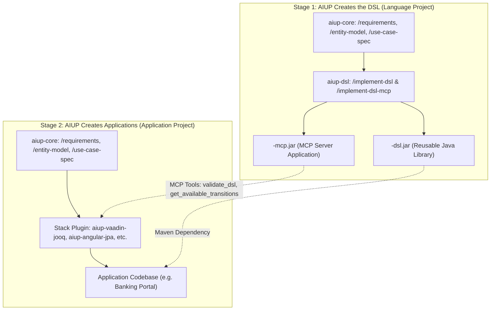

<!--
Copyright 2025-2026 Simon Martinelli and the AI Unified Process contributors.
Part of the AI Unified Process — https://unifiedprocess.ai
Licensed under the Apache License, Version 2.0. See LICENSE and NOTICE.
-->

# aiup-dsl

`aiup-dsl` is the AI Unified Process construction plugin for Java-based Domain-Specific Languages (DSLs) leveraging ANTLR 4
and Finite State Machines (FSMs). It turns the domain entity model (`docs/entity_model.md`), requirements, and use case
specifications produced by [`aiup-core`](../aiup-core/) into a reusable Java library and optional downstream developer tooling.

## The Two-Stage AIUP Lifecycle

The AI Unified Process treats DSL development and application development as two connected, sequential stages:



1. **Stage 1 (DSL Creation)**: You run AIUP to specify (`aiup-core`) and build (`aiup-dsl`) the reusable DSL library JAR and companion MCP server application.
2. **Stage 2 (Application Creation)**: Downstream application teams run AIUP (`aiup-core` + `aiup-vaadin-jooq`, `aiup-angular-jpa`, etc.) to build web applications, APIs, or services that consume `<domain>-dsl.jar`. During `/implement`, their AI coding agents query `<domain>-mcp` to write, validate, and test domain DSL scripts!

---

## When is a DSL Appropriate?

A DSL is **not appropriate or desired for every application**. Most enterprise software is best built using standard
application stack plugins ([`aiup-vaadin-jooq`](../aiup-vaadin-jooq/), [`aiup-angular-jpa`](../aiup-angular-jpa/),
[`aiup-blazor-dotnet`](../aiup-blazor-dotnet/), [`aiup-nestjs-nextjs`](../aiup-nestjs-nextjs/)) with general-purpose programming languages.

A DSL is appropriate when:
- **Strict Lifecycles & State Transitions**: Business operations must be enforced by formal finite state machines (e.g., banking/ledger balancing, sports game event scoring, workflow routing).
- **Domain-Specific Expressiveness**: Non-developer stakeholders, financial engineers, or automated agents need to express domain rules in human-readable, declarative syntax without programming boilerplate.
- **Auditability & Validation**: Operations require compile-time syntax checking, semantic invariant checks, and real-time linting before execution.

---

## Modularity: Selectable Skills

To avoid forced dependencies and monolithic delivery, `aiup-dsl` structures all components as **independent, selectable skills**. You only generate the modules your solution needs:

| Phase        | Skill                                                                                 | Responsibility                                                                       |
|--------------|---------------------------------------------------------------------------------------|--------------------------------------------------------------------------------------|
| Construction | [`/implement-dsl`](skills/implement-dsl/SKILL.md)                                     | **Core Reusable Library (`<domain>-dsl.jar`)**: ANTLR 4 grammar, Java 21 FSM, `DslEngine` Java API, JLine REPL |
| Construction | [`/implement-dsl-api`](skills/implement-dsl-api/SKILL.md)                             | **Optional REST API (`<domain>-api`)**: Spring Boot JSON REST endpoints for HTTP clients |
| Construction | [`/implement-dsl-mcp`](skills/implement-dsl-mcp/SKILL.md)                             | **Optional MCP Server (`<domain>-mcp`)**: Model Context Protocol server for AI coding agents |
| Construction | [`/implement-dsl-lsp`](skills/implement-dsl-lsp/SKILL.md)                             | **Optional LSP Server (`<domain>-lsp`)**: Eclipse LSP4J language server daemon for IDEs |
| Construction | [`/implement-dsl-vscode-extension`](skills/implement-dsl-vscode-extension/SKILL.md) | **Optional VS Code Extension (`<domain>-vscode`)**: TextMate syntax and LSP client launcher |

---

## How the `entity-model` Skill is Leveraged (Stage 1 vs. Stage 2)

The `entity-model` skill is used in both stages, with distinct, specialized roles in each:

| Phase | In `docs/entity_model.md` | What is Generated / Leveraged |
|---|---|---|
| **Stage 1: DSL Project** | **Entities & Attributes** (`ACCOUNT`, `TRANSACTION`) | The **Java 21 domain records** and target nouns in the **ANTLR 4 grammar** (`.g4`). |
| **Stage 1: DSL Project** | **Closed-Set Status Attributes** (`Values: DRAFT, BALANCED, POSTED`) | The **sealed interface hierarchy** of the **Java 21 Finite State Machine (FSM)**. |
| **Stage 1: DSL Project** | **Multi-Column Constraints** (*"Debits must equal credits"*) | The **FSM transition guards** and validation checks (`BR-*`). |
| **Stage 2: Application Project** | **Application Entities & Relationships** | The **database schema** (via Flyway, JPA, or jOOQ) persisting application data and bridging to the in-memory DSL engine. |

### End-to-End Sequence

```text
STAGE 1: DSL Creation Project (e.g. ledger-dsl)
  1. /requirements
  2. /entity-model      ──► Defines AST nouns, argument types, and FSM states
  3. /use-case-spec     ──► Defines DSL commands & expected state transitions
  4. /implement-dsl     ──► Generates <domain>-dsl.jar (reusable library JAR)
  5. /implement-dsl-mcp ──► Generates <domain>-mcp.jar (MCP server for AI agents)

STAGE 2: Application Creation Project (e.g. banking-app)
  1. /requirements
  2. /entity-model      ──► Defines DB tables, relationships, and app entities
  3. /use-case-spec     ──► Defines user screens, actions, and where DSL is invoked
  4. /flyway-migration
  5. /implement         ──► Implements app (Vaadin/Angular), calling the DSL library
                            and validated via the DSL's MCP server
```

---

## How Downstream Applications Consume the DSL & MCP Server

When a developer builds an application that leverages the DSL (e.g., a banking web application built with `aiup-vaadin-jooq` or `aiup-angular-jpa`):

1. **Add Library Dependency**:
   The application's `pom.xml` imports the reusable DSL library:
   ```xml
   <dependency>
       <groupId>com.example</groupId>
       <artifactId><domain>-dsl</artifactId>
       <version>0.1.0-SNAPSHOT</version>
   </dependency>
   ```

2. **Configure DSL MCP Server in the Application Project**:
   The application project declares the DSL MCP server in `.mcp.json`:
   ```json
   {
     "mcpServers": {
       "<domain>-dsl": {
         "type": "stdio",
         "command": "java",
         "args": ["-jar", "/path/to/<domain>-mcp.jar"]
       }
     }
   }
   ```

3. **AI-Assisted Application Implementation**:
   When the developer runs `/implement UC-XXX` in the application project:
   - The AI agent queries the DSL MCP server (`dsl://grammar`, `dsl://fsm/states`) to understand domain syntax and state rules.
   - The AI agent uses the `validate_dsl` tool to ensure any generated DSL scripts or business logic are guaranteed correct before writing application code.

---

## Installation

### Tessl

```sh
tessl init --agent agents
tessl install ai-unified-process/aiup-core
tessl install ai-unified-process/aiup-dsl
```

### Claude Code

```text
/plugin marketplace add ai-unified-process/marketplace
/plugin install aiup-core
/plugin install aiup-dsl
```

## Generated Multi-Module Structure

```text
your-solution/
├── docs/                             # Core specifications (entity_model.md, use_cases/)
├── <domain>-dsl/                     # /implement-dsl: Reusable Java library (JAR)
│   ├── pom.xml
│   ├── src/main/antlr4/             # ANTLR 4 grammar (.g4)
│   └── src/main/java/.../           # DslEngine, FSM, AST visitor, JLine REPL
├── <domain>-api/                     # /implement-dsl-api: Optional Spring Boot REST API
│   └── src/main/java/.../           # DslSessionController, session endpoints
├── <domain>-mcp/                     # /implement-dsl-mcp: Optional MCP server application
│   └── src/main/java/.../           # MCP tools, resources, prompts (stdio / SSE)
├── <domain>-lsp/                     # /implement-dsl-lsp: Optional Eclipse LSP4J daemon
│   └── src/main/java/.../           # LSP4J diagnostics, completions, hover
└── <domain>-vscode/                  # /implement-dsl-vscode-extension: Optional VS Code extension
    ├── package.json                 # TextMate syntax & language configuration
    └── src/extension.ts             # Spawns <domain>-lsp over stdio
```
