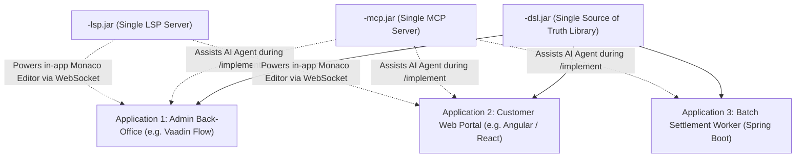

<!--
Copyright 2025-2026 Simon Martinelli and the AI Unified Process contributors.
Part of the AI Unified Process — https://unifiedprocess.ai
Licensed under the Apache License, Version 2.0. See LICENSE and NOTICE.
-->

# Model Context Protocol (MCP) Architecture for Java DSLs

This reference outlines how to build an MCP application that wraps and exposes a reusable Java DSL library (`<domain>-dsl.jar`) to AI agents and downstream AIUP workflows across multiple applications.

Like the Vaadin MCP server provides tools and context to build Vaadin web applications, the DSL MCP server equips LLMs with grammar syntax, semantic validation, runtime execution, and UI/UX generation guidance.

---

## 1. Single Source of Truth: Reusing One DSL Across Multiple Applications

A core tenet of the AIUP DSL architecture is that **a DSL is defined and maintained once**. It serves as the shared domain foundation for any number of downstream applications:



- **No Duplication**: Applications never copy, fork, or reimplement the grammar or FSM logic.
- **Unified Invariants**: Whether a transaction is initiated by an admin in a Vaadin grid, a customer in an Angular SPA, or an automated batch worker, the exact same Java 21 FSM and business rules (`BR-*`) govern execution.

---

## 2. Leveraging MCP & LSP for Application UI/UX Creation

The combination of the **DSL MCP Server** and the **DSL LSP Daemon** provides AI agents with all the intelligence needed to build rich UI/UX:

### Pattern A: State-Driven UI Controls (Buttons & Actions)
Applications often need UI views that dynamically enable, disable, or render action buttons depending on the current state of a domain entity:
- The AI agent calls the MCP tool `get_available_transitions(sessionId, currentState)`.
- The agent generates UI code (in Vaadin, Angular, or React) that inspects `availableTransitions` and binds them to UI action buttons:
  ```java
  // Example Vaadin Flow view generated by agent
  List<String> validTransitions = dslEngine.getAvailableTransitions(orderId);
  submitButton.setEnabled(validTransitions.contains("SUBMIT_PAYMENT"));
  cancelButton.setEnabled(validTransitions.contains("CANCEL_ORDER"));
  ```
- **Benefit**: The frontend does not hardcode business state rules; the UI is 100% driven by the central FSM.

### Pattern B: Live In-App Script Editor Powered by the LSP Server
Applications may want power users, auditors, or operators to type DSL scripts directly in a web screen with syntax highlighting, autocomplete, and live error squiggles:
- The `<domain>-lsp.jar` speaks standard Language Server Protocol over stdio or WebSocket.
- The web frontend embeds **Monaco Editor** (the editor engine of VS Code).
- The web server bridges WebSocket traffic to the `<domain>-lsp` process.
- The AI agent uses `dsl://ui-patterns` to generate the Monaco Editor initialization code:
  ```typescript
  // Example Angular/React Monaco setup generated by agent
  monaco.languages.register({ id: '<domain>' });
  // Connect Monaco Language Client to backend WebSocket proxying to <domain>-lsp
  ```
- **Benefit**: Power users get full IDE-grade editing (autocompletions, hover documentation, syntax error highlights) directly inside the browser application.

### Pattern C: Dynamic Form Generation from AST Metadata
- The AI agent calls `explain_verb(verb)` or inspects `dsl://grammar` to identify the parameters required for a command.
- The agent generates form input fields matching the exact data types and validation constraints:
  - String parameters $\to$ Text fields with regex validation.
  - Money/Decimal parameters $\to$ Currency input fields with precision formatting.
  - Enumerated parameters $\to$ Dropdown selects populated with valid tokens.

---

## 3. Multi-Module Project Structure

```text
<domain>-parent/
├── <domain>-dsl/                     # Reusable core library (JAR)
│   ├── pom.xml
│   └── src/main/java/...             # DslEngine, Grammar, FSM, AST visitor
└── <domain>-mcp/                     # Standalone MCP server application
    ├── pom.xml                       # Depends on <domain>-dsl
    ├── CONSUMING-THE-DSL.md          # Guide for downstream application developers & AI agents
    └── src/main/java/.../mcp/
        ├── DslMcpServerApplication.java  # Main entry point (stdio / SSE)
        ├── config/
        │   └── McpServerConfig.java      # Registration of Tools, Resources, Prompts
        ├── tools/
        │   ├── DslValidationTools.java   # validate_dsl(script)
        │   ├── DslExecutionTools.java    # execute_dsl(sessionId, command)
        │   └── DslTransitionTools.java  # get_available_transitions(state)
        ├── resources/
        │   ├── DslGrammarResource.java   # dsl://grammar
        │   ├── DslFsmResource.java       # dsl://fsm/states & dsl://fsm/diagram
        │   └── DslUiResource.java        # dsl://ui-patterns
        └── prompts/
            ├── DslScriptPrompts.java     # generate-dsl-script, troubleshoot-dsl-error
            └── DslUiPrompts.java         # generate-dsl-ui
```

---

## 4. MCP Tools & Resources Specification

| Tool Name | Parameters | Description |
|-----------|------------|-------------|
| `validate_dsl` | `script` (string) | Delegates to `DslEngine.validate(script)`. Returns syntax and FSM semantic errors with line/column coordinates. |
| `execute_dsl` | `sessionId` (optional UUID), `command` (string) | Delegates to `DslEngine.executeInSession(sessionId, command)` or `DslEngine.execute(command)`. Returns execution status, updated state, and output data. |
| `get_available_transitions` | `sessionId` (optional UUID), `currentState` (optional string) | Returns valid next commands and allowed transitions based on active FSM state. Used to build dynamic UI action controls. |
| `explain_verb` | `verb` (string) | Returns documentation, syntax variants, parameters, and business rules for a specific domain keyword/action. Used to generate form fields. |

| Resource URI | MIME Type | Description |
|---|---|---|
| `dsl://grammar` | `text/plain` | Complete ANTLR 4 grammar specification (`.g4`) with rule annotations. |
| `dsl://fsm/states` | `application/json` | JSON description of all FSM states, allowed transitions, and business rule IDs (`BR-*`). |
| `dsl://fsm/diagram` | `text/vnd.mermaid` | Mermaid state diagram representing the full lifecycle. |
| `dsl://ui-patterns` | `text/markdown` | Implementation blueprints for state-driven action buttons and embedded Monaco LSP web editors. |
| `dsl://examples/{useCase}` | `text/plain` | Canonical valid DSL scripts for use cases (e.g. `UC-001`). |

---

## 5. Client Integration (`.mcp.json`)

In any downstream application project using Claude Code, Cursor, or AIUP:

```json
{
  "mcpServers": {
    "<domain>-dsl": {
      "type": "stdio",
      "command": "java",
      "args": ["-jar", "/path/to/<domain>-mcp/target/<domain>-mcp.jar"]
    }
  }
}
```
